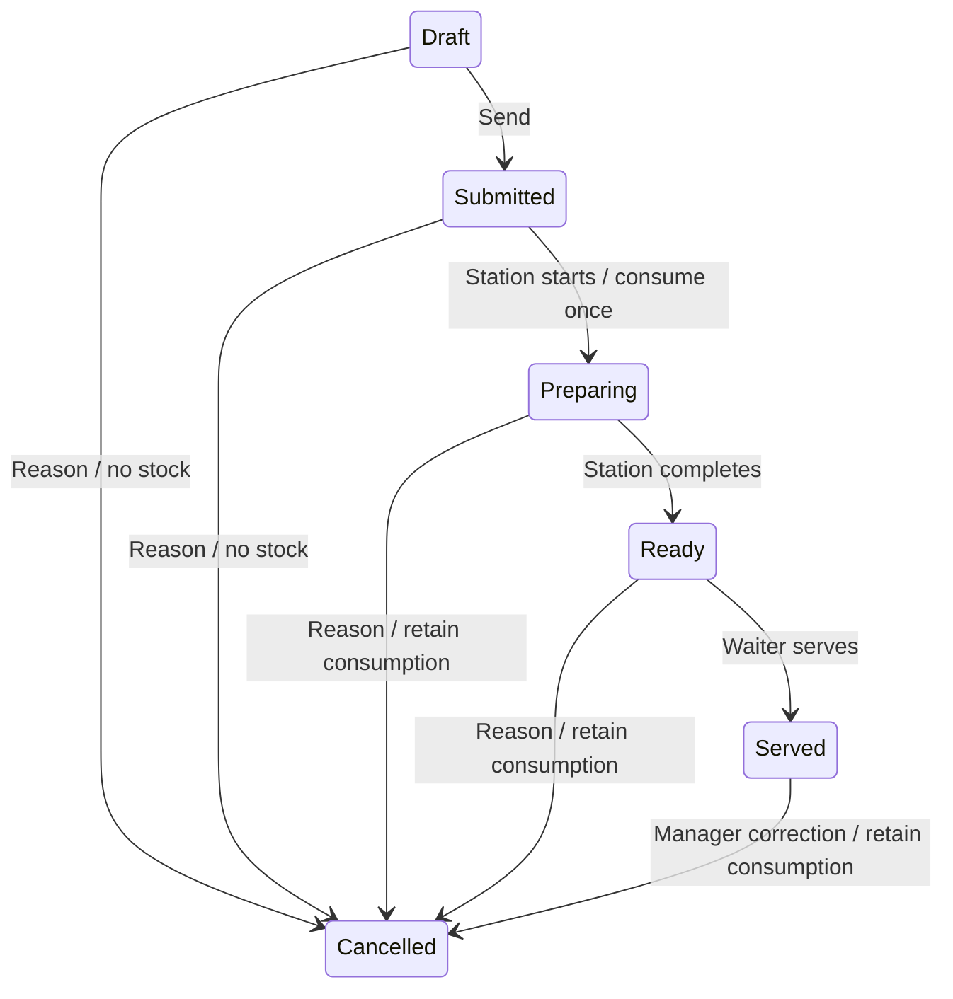

# Architecture and decisions

## Runtime and modules

React 19 with TypeScript and Vite renders a responsive browser application. Fastify 5 provides the HTTP server; `pg` provides explicit parameterized SQL and transactions. PostgreSQL 18 owns persistence. Zod validates API inputs and configuration. Decimal.js performs authoritative recipe, stock and monetary arithmetic. Argon2id hashes passwords. Vitest, React Testing Library and Playwright exercise domain, component, PostgreSQL and browser behavior.

The toolset follows the official [Fastify TypeScript documentation](https://fastify.dev/docs/latest/Reference/TypeScript/) and [Vite guide](https://vite.dev/guide/). The npm lockfile records actual versions; Node 24 is the container baseline.

## Repository and runtime entry points

The restaurant Git and application command/configuration root is `gastwerk/`, pinned as a submodule by outer `gastro_app/`. The outer repository owns production deployment and the portfolio. Run npm and Compose commands from `gastwerk/`. The sibling portfolio is a separate project. The root [package manifest](../package.json) and lockfile own dependencies; workspace globs are declared, but the app/shared directories currently have no individual package manifests. Shared code is imported directly from source rather than published packages.

| Runtime          | Start here                                                                    | Relationship                                                                                    |
| ---------------- | ----------------------------------------------------------------------------- | ----------------------------------------------------------------------------------------------- |
| Browser          | [main.tsx](../apps/web/src/main.tsx) → [App.tsx](../apps/web/src/app/App.tsx) | Session, language, polling and feature composition; calls `/api`                                |
| Development web  | [Vite configuration](../apps/web/vite.config.ts)                              | Proxies `/api` to the configured API target                                                     |
| Container web    | [Dockerfile](../apps/web/Dockerfile), [Nginx](../apps/web/nginx.conf)         | Serves built assets; resolves API through Docker DNS; static health is separate from API health |
| API              | [main.ts](../apps/api/src/main.ts) → [buildApp](../apps/api/src/app.ts)       | Fastify routes, request protection and error mapping; calls services and SQL                    |
| Database startup | [API Dockerfile](../apps/api/Dockerfile), [Compose](../compose.yaml)          | Database health → migration → seed → HTTP server; named volume persists data                    |

See [onboarding](../README.md), [API routes](api.md), [configuration](configuration.md), [user workflows](users.md) and [extensions](extensions.md). This map describes inspected source; executed verification and unresolved findings are recorded in the [Milestone 3 review](milestone-3-review.md).

## Module index

| Module          | Ownership and starting documentation                                                             |
| --------------- | ------------------------------------------------------------------------------------------------ |
| API application | [Composition and runtime](../apps/api/README.md)                                                 |
| Identity        | [Login, sessions and user administration](../apps/api/src/identity/README.md)                    |
| Catalog         | [Document validation, conversion and recipe/price resolution](../apps/api/src/catalog/README.md) |
| Configuration   | [Persisted policy and user preferences](../apps/api/src/configuration/README.md)                 |
| Service         | [Orders, snapshots, repeats, preview and aggregate state](../apps/api/src/service/README.md)     |
| Fulfillment     | [Preparation transitions and replacements](../apps/api/src/fulfillment/README.md)                |
| Inventory       | [Movement ledger and balances](../apps/api/src/inventory/README.md)                              |
| API shared      | [Mutation envelope, permissions and audit](../apps/api/src/shared/README.md)                     |
| Persistence     | [Pool, transactions, migrations and seed](../apps/api/src/persistence/README.md)                 |
| Web application | [App composition and new feature placement](../apps/web/README.md)                               |
| Waiter          | [Tables, menu, choices, order and note orchestration](../apps/web/src/features/waiter/README.md) |
| Manager         | [Catalog, policy, stock and user editing](../apps/web/src/features/manager/README.md)            |
| Preparation     | [Kitchen/bar queues](../apps/web/src/features/preparation/README.md)                             |
| Web shared      | [Transport, retries, translations and common controls](../apps/web/src/shared/README.md)         |
| Contracts       | [Zod inputs, transport types and default normalization](../packages/contracts/README.md)         |
| Config          | [Policy/default and environment schemas](../packages/config/README.md)                           |
| UI primitives   | [Field and native-dialog Modal](../packages/ui/README.md)                                        |

## Dependency directions and workflow routes

The backend is a modular monolith. HTTP mutations generally enter `mutation`, then an owning service using the same transaction client. Fulfillment imports service locking/creation and inventory consumption; service imports catalog resolution and configuration. Catalog does not update orders. Schema definitions are shared; SQL lives both in repositories and application services. There is no ORM, message broker or distributed cache.

| Change/question                   | Implemented flow and related tests                                                                                                                                                                                                                                                                                                                                                                                                            |
| --------------------------------- | --------------------------------------------------------------------------------------------------------------------------------------------------------------------------------------------------------------------------------------------------------------------------------------------------------------------------------------------------------------------------------------------------------------------------------------------- |
| Start preparation / consume stock | [transition](../apps/api/src/fulfillment/service.ts) → [lockedLine](../apps/api/src/service/service.ts) and [consume](../apps/api/src/inventory/service.ts), enclosed by [mutation](../apps/api/src/shared/mutation.ts); [database index](../apps/api/src/persistence/migrate.ts); [retry/rollback tests](../tests/api.integration.test.ts)                                                                                                   |
| Waiter quantity / repeat          | [QuantityControl](../apps/web/src/shared/ui/QuantityControl.tsx) handles pre-save count; [Order](../apps/web/src/features/waiter/order/Order.tsx) → [Service](../apps/web/src/features/waiter/Service.tsx) → [retry queue](../apps/web/src/shared/api/useMutation.ts) → [repeat/decrement/undo](../apps/api/src/service/repeat.ts); [notes/queue tests](../tests/notes.test.tsx) and [integration tests](../tests/api.integration.test.ts)    |
| Choices / serving sizes           | [ChoiceSteps](../apps/web/src/features/waiter/customize/ChoiceSteps.tsx) or [Customizer](../apps/web/src/features/waiter/customize/Customizer.tsx) → [preview hook](../apps/web/src/features/waiter/customize/usePreview.ts) / save → [service preview](../apps/api/src/service/preview.ts) / creation → [resolve](../apps/api/src/catalog/resolve.ts); [domain](../tests/domain.test.ts) and [component](../tests/components.test.tsx) tests |
| API access permission             | [request hooks/routes](../apps/api/src/app.ts) → [authenticate](../apps/api/src/identity/service.ts) → [permit](../apps/api/src/shared/audit.ts) in handlers/services; station-sensitive transition checks and [role-filtered readState](../apps/api/src/service/readState.ts); [direct API tests](../tests/api.integration.test.ts)                                                                                                          |
| New frontend feature              | [web guide](../apps/web/README.md) → `src/features/<feature>/index.ts` composed by [App](../apps/web/src/app/App.tsx); use [shared api/Mutate](../apps/web/src/shared/api/api.ts), shared contracts and server authorization; [import graph](../tests/architecture.test.ts), [components](../tests/components.test.tsx) and [browser workflows](../tests/e2e/workflow.spec.ts)                                                                |

Frontend imports normally flow App → feature entry points → shared web code/shared source packages. Stateful orchestration is split unevenly: preview and notes have hooks, while App and waiter Service retain substantial state/actions. Manager also performs its own read requests through shared transport. Rendering, hooks and pure menu filtering are distinguished in the module READMEs.

### Existing coupling and limitations

- `apps/api/src/app.ts` contains users/ledger/logout SQL and multi-line send coordination, not only transport adaptation.
- `DomainError` is exported by catalog resolution but used throughout the backend. Services also update SQL owned conceptually by neighboring modules; boundaries are conventions rather than sealed packages.
- The `AppState` response type is defined in web transport and imported by integration tests. The backend does not runtime-validate the whole response against a shared schema.
- Shared `LineCard` contains workflow actions; it is domain-aware. History rendering remains in App rather than a separate feature.
- The existing graph test covers a subset of relative static web imports, cycles and shared-to-feature dependencies. It does not enforce all layering rules.
- Aggregate state reads are unpaginated for lines/orders, and polling can overlap. A two-second timer is not a guaranteed three-second delivery bound. See the [review findings](milestone-3-review.md#findings-and-discrepancies) for suspected failure paths and coverage gaps.

## Storage and invariants

`catalog` stores schema-validated ingredient, product and table documents with revision numbers. Flat recipes belong to products; every order selection snapshots its recipe. Catalog edits do not rewrite saved snapshots; authorized draft/submitted line edits can replace that line’s snapshot using historical inputs. This avoids a separate reusable recipe lifecycle in milestone one while preserving recipe history. `configuration` stores schema version 1 and an independent revision counter. Historical configuration changes are audited.

Relational `orders`, `lines`, `movements`, `history`, `users`, `sessions` and `requests` tables enforce transactional identity and references. Catalog references inside validated documents are checked by application services. Ingredients are archived, not deleted; base units cannot change. Table numbers are unique. An occupied table cannot be archived.

A partial unique index permits one open order per table. A per-table transaction advisory lock serializes order creation and closure. Line row locks plus expected revisions protect edits/transitions. Business writes routed through the mutation envelope require a UUID retry key; login/logout and read-only preview are separate handlers. A per-user/key advisory lock serializes retries; a durable request record stores the request fingerprint and result in the same transaction as its effects. Reusing a key for different input returns 409. Request keys are retained indefinitely in this milestone.

Preparing a line inserts negative ledger quantities and advances state in one transaction. A unique index on consumption `(line_id, ingredient_id)` adds a database-level guard. Stock balances are calculated with PostgreSQL numeric sums; no independently mutable cached balance exists. Tests inject an insert failure to verify that neither partial consumption nor preparing state commits.

A submitted edit increments the revision and appends an amendment event. A stale station action receives 409. Editing one item from a multi-item line can split it, preserving original creator attribution on both lines. Preparing/ready edits use explicit cancellation plus a submitted replacement; stock from the original remains consumed. Served corrections are manager-only cancellations with an explicit reason, including after service closure. They do not reopen the order or erase stock.

Closure checks all lines are served/cancelled and frees the table. Totals omit cancelled lines and sum snapshotted unit prices multiplied by integer line quantities; no payment, tax or fiscal receipt is recorded.

## Editable policies

Pricing calculation uses exact decimal quantities up to three decimal places. Unit prices round to EUR cents using configurable half-up or half-even. Default removal policy is no refund; default additions charge each started configured portion. Proportional addition and proportional removal-refund policies are available. Prices have a zero floor. An ingredient without a surcharge is explicitly free to add; no serving default requires an explicit quantity.

Guided effects run in group/choice array order before explicit final-quantity edits. Negative effects and incompatible quantities are rejected. Choice changes after explicit edits require a visible review confirmation in the UI. Free text has no inventory semantics.

Each line snapshots pricing policy and its revision. Editing an existing line retains its original recipe, base price and pricing policy. Newly introduced ingredients use current defaults; already snapshotted ingredients keep historical defaults. Replacements are new selections and use the current catalog/policy. Policy changes never rewrite old lines.

The stock policy (allow negative balances with warnings), consumption timing and conservative replacement rule remain explicit domain invariants from the specification. They are not unchecked configurable workflow scripts. New policy types require a schema and implementation change.

## Connectivity and security

The browser fetches a consistent PostgreSQL repeatable-read state every two seconds, and immediately after successful writes, focus and reconnection. The two-second interval is a scheduling choice, not proof that the local three-second freshness target is met under latency or load; no bound is enforced by the timer. A failed fetch marks connection state; no client-side queue pretends an order was sent. Lost mutation responses retain retry metadata in per-user session storage. This metadata is not the authoritative draft or an offline synchronization engine.

Opaque random session tokens are stored as hashes in the database; the browser receives an HttpOnly, SameSite=Strict cookie with a 12-hour expiry. HTTPS deployments enable Secure cookies. Origin checking and a required custom POST header protect against cross-origin mutation. Login and general requests are rate limited. Permissions are checked in backend services, including direct API requests. Credentials and tokens are not logged. User administration invalidates that user's sessions.

## Migration approach

The migration entry point runs idempotent initial DDL under a transaction advisory lock and records version 1. Migration 2 separately checks its version before changing legacy product documents. Repeated migration and seed commands are idempotent. Future migrations should append numbered, transactional migrations and record their versions rather than modify historical data/schema definitions in place. Configuration schema changes must migrate existing documents explicitly before switching the accepted schema version; revision numbers continue to protect concurrent editors.

## Milestone two frontend boundaries

| Previous file/responsibility                          | Current module                                                                                                                                       |
| ----------------------------------------------------- | ---------------------------------------------------------------------------------------------------------------------------------------------------- |
| `App.tsx` shell, authentication, role navigation      | `src/app/App.tsx`                                                                                                                                    |
| `Service.tsx` combined tables/menu/order              | `features/waiter/Service.tsx` coordinates workspace navigation; `tables/Tables.tsx`, `menu/Menu.tsx`, `order/Order.tsx` render individual workspaces |
| Menu filtering in service rendering                   | Pure `menu/catalog.ts` transformation                                                                                                                |
| Modal `Customizer.tsx`                                | `customize/ChoiceSteps.tsx` for sequential selections; `customize/Customizer.tsx` for deliberate ingredient edits                                    |
| Preview transport and effects inside customization    | `customize/api.ts` and `customize/usePreview.ts`, with stale-response suppression                                                                    |
| Item notes inside customization                       | `order/InlineNote.tsx` and `order/useNotes.ts`; explicit flush, retry and revision handling                                                          |
| `Manager.tsx`, `CatalogForm.tsx`, `PolicyForm.tsx`    | `features/manager/`                                                                                                                                  |
| `Station.tsx`                                         | `features/preparation/Station.tsx`                                                                                                                   |
| `LineCard.tsx`, `api.ts`, `useMutation.ts`, `i18n.ts` | `shared/ui/`, `shared/api/`, `shared/i18n/`                                                                                                          |

Feature components consume shared contracts; inspected shared web modules do not import feature internals, and the current graph test checks those relative imports. Waiter styling is scoped under `.waiter-workspace`. Menu state remains mounted while choices/order occupy the workspace, preserving search, categories and favorites. A navigation guard flushes unsent notes before leaving; submitted note edits require explicit amendment. Unacknowledged requests retain their original caller until retry, and the mutation hook serializes intentional actions instead of dropping rapid taps. This is an online mutation queue, not offline synchronization.

Serving size resolution chooses the explicit size recipe/price first, then size-specific preparation effects (falling back to base choice effects), then ingredient edits. Item quantity multiplies the resolved per-serving snapshot at total/consumption time. Backend responsibilities remain authoritative.

All existing-line mutations acquire the table lock before the line row lock. Repeat serializes within the table, validates the expected configuration against the source and current catalog, and increments only matching unsent work. Quantity is deliberately excluded from repeat identity; note, serving size, choices and ingredient edits are included. Current price/recipe differences reject with `repeat_review`. Sent snapshots and consumed stock remain unchanged. Zero decrement records a cancellation without consumption; its revision-checked Undo restores only a line removed by that action in an open order.

Migration 2 adds empty `sizes` arrays to existing product documents and increments affected catalog revisions. It also translates untouched legacy apple demo labels to the new short tile labels, preserving customized labels. Recipes, commercial prices, historical snapshots, stock and orders are preserved. The seed adds a separate size demonstration product; it never assigns new commercial sizes/prices to an existing product.

## Production deployment boundary

The earlier startup table describes **local development Compose**. Root [deployment tooling](../../deploy/README.md) checks the source/submodule checkout and owns the two web image builds. Root [production Compose](../../compose.production.yaml) is independent: external Traefik → non-root static restaurant Nginx on 8080 → private API on 3001 → private PostgreSQL 18 with stable persistent volume. Portfolio Nginx is a separate edge-network service. API/DB have no published host ports, app containers have no Docker socket, and no uploads directory was identified.

[Deployment initialization](../apps/api/src/deployment/README.md) owns production secret-file parsing and explicit migration/bootstrap entry points; it does not change business persistence rules. Normal API startup neither migrates nor seeds. The [web configuration generator](../../deploy/render-nginx.mjs) owns same-origin API proxying, scoped forwarding trust and exact iframe policies. The fixed gateway address is outside the dynamic private allocation range. [Deployment](../../docs/deployment.md) and [operations](../../docs/operations.md) own server configuration, Git release selection, backup and recovery behavior.

The browser App also owns a [sticky source bar](../apps/web/src/app/SourceBar.tsx), configured by [source.ts](../apps/web/src/app/source.ts). It renders outside role views and inside each embedded document. Its measured height offsets waiter sticky navigation and document focus scrolling; it has no API or portfolio dependency.
